<picture>
  <source media="(prefers-color-scheme: dark)" srcset="./header-dark.svg">
  <source media="(prefers-color-scheme: light)" srcset="./header-light.svg">
  
</picture>

  
  
  

## `> about`

I'm a Computer Science student at the University of Toronto Scarborough who likes turning ideas into useful, understandable software. My main direction is **software engineering**—especially full-stack products, backend services, and API design. Alongside that, I'm building a foundation in **AI and machine learning** through small experiments and focused study.

- **Building:** practical applications with thoughtful APIs and clean user experiences
- **Improving:** C++ problem solving, backend architecture, testing, and deployment
- **Exploring:** machine-learning fundamentals without treating experiments as finished products
- **Based in:** Toronto, Canada

## `> featured build`

### [Is My Website Down? →](https://github.com/JerryX2007/networkstatusmonitor)

A full-stack availability checker that runs fresh website checks, reports response time and status, provides dedicated result pages, visualizes community outage reports, and supports anonymous reporting with duplicate-report protection.

  
  
  
  
  

| Product | Engineering |
| --- | --- |
| Live HTTP/HTTPS checks and clear status pages | React + TypeScript frontend with a FastAPI backend |
| Response-time and outage-history visualization | Input normalization and private-address rejection |
| Anonymous community outage reporting | Hashed reporter IDs and duplicate-report protection |
| Responsive desktop and mobile layouts | Persistent checks and reports in SQLite |

  <a href="https://github.com/JerryX2007/networkstatusmonitor"><strong>Explore the code and architecture →</strong></a>

## `> engineering stack`

**Languages**

  
  
  
  
  
  
  

**Frameworks and data**

  
  
  
  

**Workflow**

  
  
  
  

## `> current direction`

| Priority | What it means for me |
| --- | --- |
| **1. Software engineering** | Build reliable full-stack systems, improve API and database design, test more deliberately, and ship projects people can actually use. |
| **2. AI and machine learning** | Learn the mathematical and programming foundations through small experiments before presenting anything as a complete ML project. |
| **Always** | Strengthen data structures, algorithms, debugging, and the ability to explain technical decisions clearly. |

<strong>More code and practice</strong>

- [C++ problem-solving practice](https://github.com/JerryX2007/leetcode)

 

  <strong>Build useful things. Explain them clearly. Improve them relentlessly.</strong>

