### <code>jerry@github ~ $ whoami</code>

  
  

 

### <code>jerry@github ~ $ ./contributions.sh</code>

 

### <code>jerry@github ~ $ ./profile.sh</code>

Computer Science @ University of Toronto Scarborough 
Software Engineering · AI / Machine Learning

 

## `> about`

I'm a Computer Science student at the University of Toronto Scarborough who enjoys turning ideas into useful, understandable software. My main direction is **software engineering**—especially full-stack products, backend services, and API design. I'm also building a foundation in **AI and machine learning** through focused study and small experiments.

- **Building:** practical applications with thoughtful APIs and clean user experiences
- **Improving:** C++ problem solving, backend architecture, testing, and deployment
- **Exploring:** machine-learning fundamentals without presenting experiments as finished projects
- **Based in:** Toronto, Canada

## `> featured build`

### [Is It Down? →](https://github.com/JerryX2007/isitdown)

A full-stack availability checker that runs fresh website checks, reports response time and status, visualizes community outage reports, and supports anonymous reporting with duplicate-report protection.

  
  
  
  
  

| Product | Engineering |
| --- | --- |
| Live HTTP/HTTPS checks with clear status pages | React + TypeScript frontend with a FastAPI backend |
| Response-time and outage-history visualization | Input normalization and private-address rejection |
| Anonymous community outage reporting | Hashed reporter IDs and duplicate-report protection |
| Responsive desktop and mobile layouts | Persistent checks and reports in SQLite |

## `> toolkit`

**Languages**

  
  
  
  
  

**Frameworks and data**

  
  
  
  

**Workflow**

  
  
  
  

## `> current direction`

| Priority | What I'm working toward |
| --- | --- |
| **Software engineering** | Reliable full-stack systems, stronger API and database design, deliberate testing, and projects people can use |
| **AI / ML** | Mathematical and programming foundations developed through focused learning and honest experiments |
| **Core skills** | Data structures, algorithms, debugging, and clearly explaining technical decisions |

<strong>More code and practice</strong>

- [C++ problem-solving practice](https://github.com/JerryX2007/leetcode)

 

  <strong>Build useful things. Explain them clearly. Keep improving.</strong>

