  

  
  
  
  

  
  &nbsp;
  

### `$ cat about.md`

I'm a Computer Science student at the **University of Toronto Scarborough** who likes building useful, understandable software — full-stack products, backend services, API design, databases, testing and deployment.

- Building **[isitdown](https://github.com/JerryX2007/isitdown)**: server-side checks + community outage reports
- Exploring AI/ML foundations
- Sharpening reliable deploys, testing and API design
- Reach me at **xingjerry7@gmail.com**

  

### `$ ls ~/projects --pinned`

| Project | What it is | Built with |
| --- | --- | --- |
| [**isitdown**](https://github.com/JerryX2007/isitdown) | Website availability checker combining server-side checks with community outage reports | React · TypeScript · FastAPI · PostgreSQL · GitHub Actions · Vercel |
| [**study_task_manager**](https://github.com/JerryX2007/study_task_manager) | A fully working full-stack web app, built to learn Flask and SQLite end to end | JavaScript · Flask · SQLite |

### `$ echo $STACK`

  
  
  
  
  
  
  
  
  
  
  
  
  
  
  

